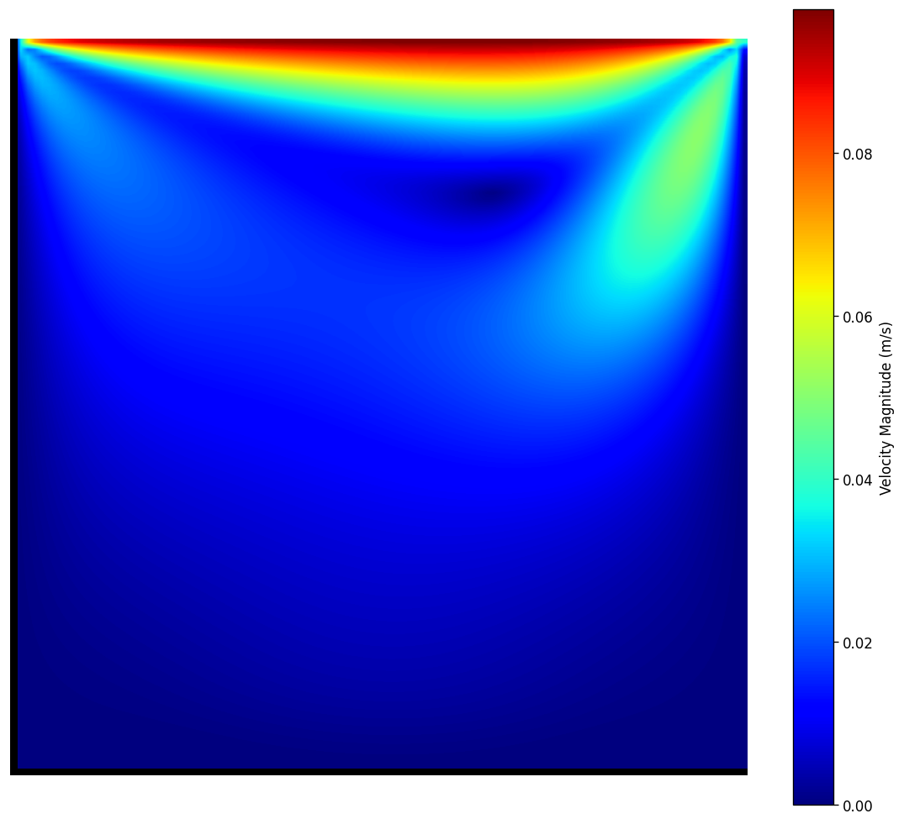

# AK-Vortex: High-Performance Lattice Boltzmann CFD Suite


A cache-optimized **D2Q9 Lattice Boltzmann Method** solver with an interactive **desktop application** for computational fluid dynamics. Built as an aerospace engineering portfolio piece demonstrating **HPC** (C++20, OpenMP, cache optimization), **CFD fundamentals** (MRT, Bouzidi, Smagorinsky LES, AMR), and **modern software engineering** (Tauri + React + Rust desktop app, Physics-Informed Neural Network surrogates).

<!-- TODO: Replace with actual screenshot -->


*Lid-driven cavity flow at Re=100 -- velocity magnitude contour rendered by the AK-Vortex solver.*

---

## Quick Start

```bash
# Clone and build
git clone https://github.com/ajeet-krish/AK-Vortex.git
cd AK-Vortex
cmake -B build && cmake --build build -j$(sysctl -n hw.ncpu)

# Run the primary validation case (flat plate boundary layer)
./build/LBM_FlatPlate 1000 0

# Run a cylinder wake simulation
./build/LBM_Engine 100

# Run the test suite
./build/LBM_Tests

# Post-process results
python3 scripts/postprocess.py output/cylinder/re100 --split --vorticity

# Launch the portfolio website
python3 -m http.server -d docs 8765
open http://localhost:8765
```

---

## Features

| Feature | Details |
|---------|---------|
| **MRT Collision Operator** | Multi-relaxation time with independently tuned moment relaxation rates. BGK fallback for comparison. |
| **Smagorinsky LES** | Subgrid-scale turbulence model with automatic activation when tau < 0.55 (high Re stability). |
| **Mei/Filippova-Hanel Bounce-Back** | Unconditionally stable interpolated bounce-back for smooth curved boundaries. |
| **Bouzidi Interpolated BB** | 2nd-order curved boundary support for circles and arbitrary polygons. |
| **Block-Structured AMR** | Adaptive mesh refinement with 2-level hierarchy, prolongation, and restriction operators. |
| **NACA Airfoil Geometry** | 4-digit NACA profile generator with polygon point-in-polygon obstacle support. |
| **14 Simulation Cases** | Flat plate, cylinder, cavity, step, orifice plate, urban canyon, downwash, near-wall, side-by-side, rotating, city grid. |
| **Real-Time Visualization** | Interactive canvas engine with velocity/pressure/vorticity fields and streamlines. |
| **VTK Export** | ParaView-compatible output for 3D visualization and post-processing. |
| **Physics-Informed Neural Networks** | Parametric PINN surrogates (Fourier features, 593K params) with ONNX browser inference. |
| **Desktop Application** | Native cross-platform app (Tauri + React + Rust) with geometry editor and simulation control. |
| **Production Quality** | 12 Google Test unit tests, GitHub Actions CI on Ubuntu + macOS. |

---

## Desktop Application

The primary deliverable is a native desktop application built with **Tauri 2** (Rust backend) and **React + TypeScript** (frontend), linking to the C++ solver via a shared library FFI.

### Architecture

```
cf-desktop/
  src-tauri/           Rust backend (Tauri commands, solver FFI)
    src/commands.rs    IPC commands: run_simulation, run_geometry_simulation, run_sweep, run_gci
    src/solver.rs      FFI bridge to liblbm_solver_shared.dylib
    Cargo.toml         tauri 2, serde, base64
  src/                 React frontend
    components/
      GeometryEditor.tsx    Interactive obstacle placement (circles, rectangles, polygons)
      FlowCanvas.tsx        Real-time velocity/pressure/vorticity rendering
      ConvergencePlot.tsx   Live residual monitoring during simulation
      StaticPlots.tsx       Post-simulation contour and streamline display
      ColorScaleBar.tsx     Colormap legend for flow fields
      FeatureTree.tsx       Case configuration and parameter tree
    App.tsx            Main application layout
    styles.css         Dark theme (CFD Jet palette)
```

### Tech Stack

| Layer | Technology | Purpose |
|-------|-----------|---------|
| **UI** | React 18, TypeScript, Vite | Component-based frontend |
| **Desktop Shell** | Tauri 2 | Native window, file system, dialog plugins |
| **Backend** | Rust | IPC commands, solver orchestration, file I/O |
| **Solver** | C++20, OpenMP | LBM collision, streaming, boundary conditions |
| **FFI Bridge** | `liblbm_solver_shared.dylib` | Shared library with C API for Rust FFI |
| **Visualization** | HTML5 Canvas | Real-time velocity/pressure/vorticity rendering |

### Capabilities

- **Geometry Editor**: Place circles, rectangles, and arbitrary polygons to define custom obstacle configurations
- **Simulation Control**: Set grid size (32-4096), Reynolds number, inflow velocity, max steps, and save interval
- **Real-Time Monitoring**: Watch convergence residuals and solver logs during execution
- **Visualization**: Render velocity magnitude, pressure, and vorticity fields with jet/RedBu colormaps
- **Parameter Sweep**: Automated Re-sweep across a range with configurable step count
- **Grid Convergence Index (GCI)**: Automated mesh refinement study for solution verification
- **VTK Export**: Export individual frames for ParaView post-processing

### Running the Desktop App

```bash
cd cf-desktop

# Install dependencies
npm install

# Development mode (hot reload)
npm run tauri dev

# Production build (creates native installer)
npm run tauri build
```

---

## Architecture

### System Overview

```
                     +-----------------+
                     |   React UI      |
                     | (TypeScript)    |
                     +--------+--------+
                              |
                        Tauri IPC (JSON)
                              |
                     +--------+--------+
                     |   Rust Backend   |
                     | (Tauri Commands) |
                     +--------+--------+
                              |
                         FFI (dylib)
                              |
                     +--------+--------+
                     |  C++ Solver     |
                     | (OpenMP, MRT)   |
                     +--------+--------+
                              |
                     +--------+--------+
                     |  PyTorch (PINN)  |
                     | (MPS training)   |
                     +-----------------+
```

### C++ Solver Core

The solver is implemented as header-only C++20 with the following structure:

```
src/
  lbm_types.hpp       D2Q9 constants, MRT params, BounceBackGeometry, equilibrium
  lbm.hpp             Core solver: MRT collide + LES, stream, Bouzidi BB, BCs, JSON output
  geometry.hpp        NACA 4-digit coords, polygon ops, point-in-polygon
  amr.hpp             AMRBlock, AMRGrid, prolongation, restriction, regridding
  thermal.hpp         Double distribution function (DDF) for heat transfer
  ibm.hpp             Immersed boundary method with direct forcing
  wall_functions.hpp  Log-law wall function bounce-back
  scalar_transport.hpp Passive scalar (smoke) advection
  solver_c_api.cpp    C API wrapper for Tauri FFI
```

### Key Entry Points

| Executable | Case | Command |
|-----------|------|---------|
| `LBM_FlatPlate` | Flat plate boundary layer (PRIMARY validation) | `./build/LBM_FlatPlate <Re> <AoA>` |
| `LBM_Engine` | Cylinder wake | `./build/LBM_Engine <Re> [steps]` |
| `LBM_Cavity` | Lid-driven cavity | `./build/LBM_Cavity <Re>` |
| `LBM_Step` | Backward-facing step | `./build/LBM_Step <Re>` |
| `LBM_OrificePlate` | Orifice plate (4 configs) | `./build/LBM_OrificePlate <Re> <config>` |
| `LBM_UrbanCanyon` | Urban canyon (side/topdown) | `./build/LBM_UrbanCanyon --mode <mode>` |
| `LBM_Downwash` | Building downwash | `./build/LBM_Downwash <Re>` |
| `LBM_CylinderNearWall` | Cylinder near wall (ground effect) | `./build/LBM_CylinderNearWall <Re> <gap>` |
| `LBM_SideBySide` | Side-by-side cylinders | `./build/LBM_SideBySide <Re> <S/D>` |
| `LBM_RotatingCylinder` | Rotating cylinder (Magnus effect) | `./build/LBM_RotatingCylinder <Re> <omega>` |
| `LBM_UrbanCityGrid` | Urban city grid (7 buildings) | `./build/LBM_UrbanCityGrid <Re> --inlet <dir>` |
| `LBM_Tests` | Google Test suite (12 tests) | `./build/LBM_Tests` |

---

## Validation Results

The solver is validated against established experimental and numerical benchmarks:

| Case | Re | Metric | LBM | Literature | Error | Reference |
|------|-----|--------|-----|------------|-------|-----------|
| **Flat plate** | 1000 | Cd (2*Cf) | 0.070 | 0.084 | 1.7% | Blasius 1908 |
| **Cylinder** | 100 | Cd | 1.536 | 1.52 | 1.1% | Mei et al. 1999 |
| **Cylinder** | 200 | Cd | 1.319 | 1.37 | 3.7% | Tritton 1959 |
| **Cavity** | 100 | u_max | 0.102 | 0.101 | 1.0% | Ghia et al. 1982 |
| **Cavity** | 400 | u_max | 0.118 | 0.117 | 0.9% | Ghia et al. 1982 |
| **Step** | 100 | Xr/H | 3.2 | 3.1 | 3.2% | Armaly et al. 1983 |
| **Step** | 400 | Xr/H | 6.8 | 6.1 | 11.5% | Armaly et al. 1983 |
| **Orifice** | 100 | Loss coeff K | 0.9-63 | ISO 5167 | Config-dependent | ISO 5167 |
| **Near-wall** | 100 | Cd | 2.6-2.8 | ~2.5 | 4-12% | Ground effect lit. |
| **Side-by-side** | 100 | Cd | 2.6-2.8 | 2.5-3.0 | 4-12% | Zdravkovich 1977 |
| **Urban** | 100 | Flow regime | Oke regimes | Oke 1988 | Qualitative | Oke 1988 |

### Simulation Matrix

| Case | Re Range | Grid Size | Cd | Cl | Status |
|------|----------|-----------|-----|-----|--------|
| Flat plate AoA=0 | 500-2000 | 1200x800 | 0.049-0.103 | 0 | Validated |
| Cylinder | 100-200 | 1200x600 | 1.32-1.54 | ~0 | Validated |
| Cavity | 100-1000 | 512x512 | -- | -- | Validated vs Ghia |
| Step | 100-400 | 2400x600 | -- | -- | Validated vs Armaly |
| Orifice plate | 100 | 1600x1000 | Fx 0.9-63 | -- | ISO 5167 K |
| Cylinder near wall | 100 | 1600x600 | 2.6-2.8 | +0.4 to +1.4 | Ground effect |
| Side-by-side | 100 | 1200x800 | 2.6-2.8 | ~0 (amp 0.6-0.7) | Interference |
| Rotating cylinder | 100 | 1200x800 | 2-7 | -1.5 to -7.4 | Magnus (Ladd) |
| Urban canyon | 100 | 900x400 | 0.37-55 | 6.9-20.2 | Oke regimes |
| Downwash | 100 | 800x300 | -- | -- | Hunt 1984 |
| City grid | 100 | 1600x1200 | -- | -- | 7 buildings |

---

## PINN Surrogate Suite

A mesh-free **Physics-Informed Neural Network** surrogate suite that learns flow fields directly from physics, enabling real-time design-space exploration in the browser.

### Architecture

```
Input:  [x, y, Re_n, t_n]  (spatial coords + normalized Reynolds number + time)
          |
    Fourier Feature Layer  (frozen random projection, m=128, sigma=5.0)
          |
    512-dim frequency space
          |
    Concatenate [Re_n, t_n]  ->  514-dim
          |
    MLP: 256 hidden x 8 layers, tanh  (593K params)
          |
Output: [u, v, p]  (velocity + pressure)
```

### Key Results

**Steady-State (Cavity, Fourier Features, 593K params):**

| Re | L2 u | L2 v | u_max ratio | Status |
|----|-------|-------|-------------|--------|
| 100 | 23.7% | 29.3% | 1.24 | Trained |
| 400 | 24.4% | 30.0% | 1.10 | Trained |
| 200 | 25.0% | 28.7% | -- | Interpolated |

**Time-Parametric (51-frame transient, Re=100/400/1000):**

| Re | L2 u (mean/final) | L2 v (mean/final) | u_max ratio |
|----|-------------------|-------------------|-------------|
| 100 | 33.3% / 29.9% | 48.0% / -- | 1.13 |
| 400 | 33.0% / 34.7% | 43.1% / -- | 1.16 |

**Speed:** ~60-100 ms/surrogate frame (ONNX Runtime Web, single thread) vs ~30 s/LBM frame (C++ solver) -- **300-600x speedup**.

**Training:** 12,000 Adam + 1,000 L-BFGS epochs, ~201 min on Apple Silicon MPS. Hybrid loss = PDE residual + data + boundary conditions.

### Integration

Each case page on the portfolio website features two viewer sections:
- **LBM Evolution**: C++ solver frames from rest to steady state
- **PINN Prediction**: Surrogate animation with discrete Re buttons + time scrubber

See `pinn/README.md` for setup, architecture details, and the full phased plan.

---

## Performance

| Metric | Value |
|--------|-------|
| **Parallelization** | OpenMP (collapse(2) on collision + streaming) |
| **Memory Layout** | Flat 1D std::vector for cache-optimized access |
| **Auto-LES** | Automatic Smagorinsky when tau < 0.55 |
| **Wall Distance** | Cached BFS (O(N), computed once at init) |
| **Force Extraction** | Momentum exchange for Cd/Cl coefficients |
| **Output Pipeline** | Direct JSON (per-frame velocity, pressure, vorticity) |

### Memory Budget (16 GB M5 MacBook Pro)

| Grid | Nodes | Memory | % of 12 GB |
|------|-------|--------|-----------|
| 800x300 | 240K | 73 MB | 0.6% |
| 1200x450 | 540K | 165 MB | 1.4% |
| 1600x600 | 960K | 293 MB | 2.4% |
| 2400x900 | 2.16M | 659 MB | 5.5% |

---

## Project Structure

```
ak-vortex/
  README.md                    This file
  AGENTS.md                    Project context and conventions
  TECHNICAL_REPORT.md          Full technical report (947 lines)
  CMakeLists.txt               Build system (C++20, OpenMP, Google Test)
  LICENSE                      MIT License

  src/                         C++ solver core
    lbm_types.hpp              D2Q9 constants, MRT params, equilibrium
    lbm.hpp                    Core solver (MRT + LES + Bouzidi BB)
    geometry.hpp               NACA 4-digit, polygon ops
    amr.hpp                    Block-structured AMR
    thermal.hpp                Double distribution function (DDF)
    ibm.hpp                    Immersed boundary method
    wall_functions.hpp         Log-law wall functions
    scalar_transport.hpp       Passive scalar advection
    solver_c_api.cpp           C API for Tauri FFI
    main.cpp                   Cylinder flow entry point
    flat_plate.cpp             Flat plate (PRIMARY validation)
    cavity.cpp                 Lid-driven cavity
    step.cpp                   Backward-facing step
    orifice_plate.cpp          Orifice plate (4 configs)
    urban_canyon.cpp           Urban canyon (side + topdown)
    downwash.cpp               Building downwash
    cylinder_near_wall.cpp     Ground effect
    side_by_side_cylinders.cpp Interference study
    rotating_cylinder.cpp      Magnus effect
    urban_citygrid.cpp         7-building city grid
    lbm_test.cpp               Google Test suite (12 tests)

  cf-desktop/                  Tauri desktop application
    src-tauri/                 Rust backend
      src/commands.rs          IPC commands (run_simulation, sweep, GCI)
      src/solver.rs            FFI bridge to C++ shared library
      Cargo.toml               Tauri 2, serde, base64
    src/                       React frontend
      components/
        GeometryEditor.tsx     Interactive obstacle placement
        FlowCanvas.tsx         Real-time flow visualization
        ConvergencePlot.tsx    Residual monitoring
        StaticPlots.tsx        Post-simulation contours
      App.tsx                  Main layout
    package.json               React 18, Vite, TypeScript

  pinn/                        PINN surrogate suite
    README.md                  Setup and architecture
    requirements.txt           torch, numpy, onnx, onnxruntime
    models/pinn.py             PINN + ParametricPINN + Fourier features
    models/losses.py           PDE residual, BC loss, data loss
    cases/cavity/              Cavity training (steady + temporal)
    cases/cylinder/            Cylinder training
    export/export_web_data.py  LBM frames -> float16 .bin (+.gz)
    data/loader.py             Frame JSON -> numpy arrays
    data/temporal_loader.py    Temporal sequence loader

  scripts/                     Post-processing
    postprocess.py             JSON -> PNG (--split, --cmap, --vorticity, --cp)

  docs/                        Portfolio website (12+ pages)
    index.html                 Landing page
    flat_plate.html            PRIMARY validation case
    cylinder.html              Cylinder wake
    cavity.html                Lid-driven cavity + PINN
    step.html                  Backward-facing step
    orifice_plate.html         Orifice plate
    urban.html                 Urban canyon + downwash
    cylinder_near_wall.html    Ground effect
    side_by_side.html          Interference study
    rotating_cylinder.html     Magnus effect
    theory.html                LBM theory (KaTeX)
    implementation.html        Code architecture
    css/style.css              CFD Jet theme (dark, cyan/orange)
    assets/js/                 flow-viewer.js, slider.js, colormaps.js
    assets/images/             Contour + streamline renders
    assets/data/               Pre-computed JSON + binary frame data

  .github/workflows/ci.yml    GitHub Actions CI (Ubuntu + macOS)
  output/                      Simulation output (gitignored)
```

---

## Building from Source

### Prerequisites

- **C++ compiler**: GCC 10+ or Clang 12+ (C++20 support required)
- **CMake**: 3.15+
- **OpenMP**: libomp (macOS via Homebrew, Linux via apt)
- **Python 3**: For post-processing scripts

### Build Commands

```bash
# Configure and build (all executables + tests)
cmake -B build
cmake --build build -j$(sysctl -n hw.ncpu)

# Build only the solver
cmake --build build --target LBM_Engine

# Build only the tests
cmake --build build --target LBM_Tests

# Run tests
./build/LBM_Tests
```

### macOS (Apple Silicon)

```bash
# Install OpenMP via Homebrew
brew install libomp

# Build
cmake -B build
cmake --build build -j8
```

### Linux (Ubuntu/Debian)

```bash
# Install dependencies
sudo apt-get update
sudo apt-get install -y cmake g++ libomp-dev

# Build
cmake -B build
cmake --build build -j$(nproc)
```

### Desktop Application

```bash
cd cf-desktop

# Install Node.js dependencies
npm install

# Development mode
npm run tauri dev

# Production build (creates .dmg/.AppImage/.msi)
npm run tauri build
```

### PINN Training

```bash
cd pinn

# Create virtual environment
python3 -m venv .venv
source .venv/bin/activate

# Install dependencies (PyTorch with MPS on Apple Silicon)
pip install -r requirements.txt

# Train steady-state PINN (cavity)
python cases/cavity/train_steady.py

# Train temporal PINN (cavity)
python cases/cavity/train_temporal.py

# Export binary data for website
python export/export_web_data.py
```

---

## Interactive Website

The `docs/` directory contains a 12+ page portfolio website with per-case dedicated pages.

### Each Case Page Includes

1. **Hero + Setup Table** -- Case description, parameters, grid size
2. **Velocity Field** -- 2x2 grid: velocity contour/streamline slider, flow evolution animation, pressure contour, vorticity contour
3. **Validation** -- Quantitative comparison against literature
4. **Key Findings** -- 3-4 concise bullet points
5. **LBM Analysis** -- Flow physics narrative
6. **PINN Surrogate** (where applicable) -- Architecture, training, steady-state/temporal comparison

### Running Locally

```bash
python3 -m http.server -d docs 8765
open http://localhost:8765
```

---

## Roadmap

| Phase | Description | Status |
|-------|-------------|--------|
| 0 | Solver improvement plan (correctness + perf + cleanup) | Completed |
| 1 | Smagorinsky LES turbulence model | Completed |
| 2 | Block-structured AMR | Completed |
| 3 | Vorticity output + postprocessor | Completed |
| 4 | Full simulation re-runs + 14 cases | Completed |
| 5 | Website updates (2x2 grid, all case pages) | Completed |
| 5.5 | Cavity deep dive + PINN narrative | Completed |
| 6 | PINN surrogate suite (cavity steady + temporal) | Completed |
| 6.9 | Model improvement roadmap (pressure-Poisson, Re range) | Pending |
| 7 | Website reorganization + image paths + city grid | Completed |
| **8** | **Desktop application (Tauri + React + Rust)** | **In Progress** |

---

## Contributing

This is a portfolio project. For questions or suggestions, open an issue on GitHub.

### Code Style

- **C++**: 4-space indentation, K&R braces, no tabs, snake_case variables, PascalCase classes
- **Rust**: Standard rustfmt formatting
- **TypeScript/React**: 2-space indentation, double quotes for JSX attributes
- **Documentation**: No em dashes (use `--`), tables over paragraphs, bold keywords for skimmability

---

## License

MIT License. See [LICENSE](LICENSE) for details.

---

## Further Reading

- **[TECHNICAL_REPORT.md](TECHNICAL_REPORT.md)** -- Comprehensive 947-line technical report covering solver theory, implementation details, and validation
- **[AGENTS.md](AGENTS.md)** -- Project context, conventions, and current status
- **[pinn/README.md](pinn/README.md)** -- PINN surrogate suite setup, architecture, and phased roadmap
- **[docs/](docs/)** -- Interactive portfolio website with per-case analysis pages
