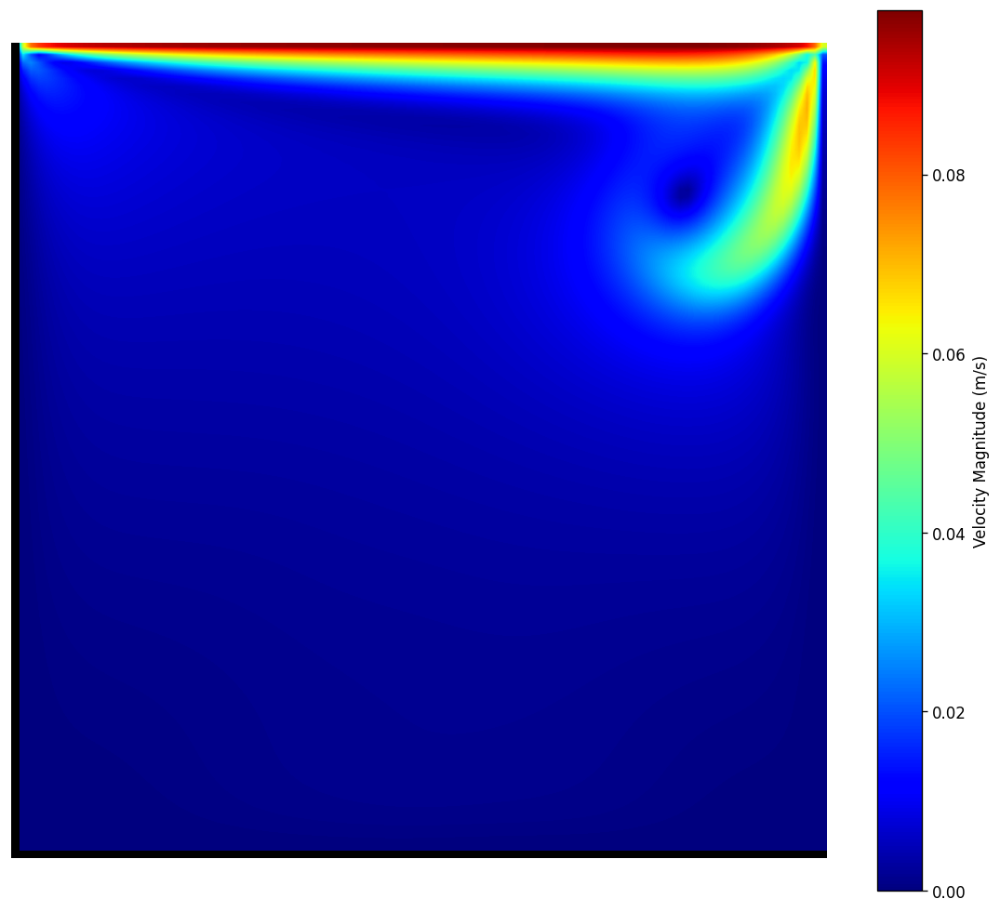

# AK-Vortex: High-Performance C++ Lattice Boltzmann CFD Solver

[](https://github.com/ajeet-krish/AK-Vortex/actions)
[](https://en.cppreference.com/w/cpp/20)
[](LICENSE)

AK-Vortex is a custom 2D CFD solver using the Lattice Boltzmann Method, packaged into a desktop application with a geometry editor, real-time flow visualization, and parameter study tools. Built with Rust and C++.

---

## Quick Start

### Full Rebuild and Launch (one command)

```bash
cd /Users/ajeet/Projects/AK-Vortex

# 1. Build C++ solver shared library
cmake --build build --target lbm_solver_shared -j$(sysctl -n hw.ncpu)

# 2. Build frontend
cd cf-desktop && npm run build

# 3. Launch desktop app
cd src-tauri && cargo tauri dev
```

Or use the combined launcher:

```bash
cd /Users/ajeet/Projects/AK-Vortex/cf-desktop
./launch.sh
```

### Build and Test

```bash
# Clone and build everything
git clone https://github.com/ajeet-krish/AK-Vortex.git
cd AK-Vortex
cmake -B build && cmake --build build -j$(sysctl -n hw.ncpu)

# Run the test suite (26 tests)
./build/LBM_Tests           # 12/12
./build/BodyFittedGrid_Tests # 14/14

# Run reference simulations
./build/LBM_Cavity 100      # Lid-driven cavity Re=100
./build/LBM_Step 100        # Backward-facing step Re=100
./build/LBM_OrificePlate 100 1p1h  # Orifice plate Re=100
```

### Launch Portfolio Website

```bash
python3 -m http.server -d docs 8765
```

---

## Demo



*Lid-driven cavity flow at Re=1000, velocity magnitude contour rendered by the AK-Vortex solver.*

---

## Why AK-Vortex

Most commercial analysis tools are locked into specific operating systems or requirements with little flexibility. Commercial solvers like ANSYS are powerful tools, but their complexity hides away the underlying physics. To better understand CFD at the implementation level, I set out to build a solver from scratch.

---

## Application Walkthrough

### Geometry Editor

Draw circles, rectangles, and polygons directly on the canvas. Design a 4-digit NACA airfoil with parametric camber, thickness, and rotation controls. Select mesh topology: Cartesian, C-grid (airfoils), or O-grid (cylinders).

### Simulation Control

Configure grid size, Reynolds number, and inflow velocity. Press Run and watch the solver log stream in real time as the C++ backend executes the LBM timestep loop via FFI. The progress bar tracks completion while the solver runs at full native speed.

### Flow Visualization

Render velocity magnitude, pressure, or vorticity fields. Toggle streamlines and quiver overlays. Probe any point to read local u, v, rho, p, and omega values. Watch the flow develop frame-by-frame from rest to steady-state.

### Parameter Studies

Run parameter sweeps across Reynolds numbers and geometry configurations. Compare two simulations side-by-side. Launch a GCI grid convergence study from the same interface.

---

## Key Capabilities

- **MRT Collision Operator**: Multi-relaxation time with independently tuned moment relaxation rates
- **Smagorinsky LES**: Subgrid-scale turbulence model with automatic activation at high Re
- **Mei/Filippova-Hanel Bounce-Back**: Unconditionally stable interpolated boundary treatment
- **Block-Structured AMR**: Adaptive mesh refinement with prolongation and restriction operators
- **Body-Fitted Grids**: C-grid (airfoils) and O-grid (cylinders) with coordinate transformations
- **Divergence Detection**: Catches NaN/Inf early and reports clear errors instead of silent zero output
- **Desktop Application**: Native cross-platform app with geometry editor and simulation control
- **Production Quality**: 26 unit tests, GitHub Actions CI on Ubuntu + macOS

---

## Architecture

```
                     +-----------------+
                     |   React UI      |
                     | (TypeScript)    |
                     +--------+--------+
                              |
                        Tauri IPC (JSON)
                              |
                     +--------+--------+
                     |   Rust Backend   |
                     | (Tauri Commands) |
                     +--------+--------+
                              |
                         FFI (dylib)
                              |
                     +--------+--------+
                     |  C++ Solver     |
                     | (OpenMP, MRT)   |
                     +-----------------+
```

The C++ solver runs as a shared library (`liblbm_solver_shared.dylib`) linked via FFI. The Rust/Tauri backend manages IPC, filesystem, and solver orchestration. The React frontend renders all UI with Canvas-based flow visualization.

### C++ Solver Core

```
src/
  lbm_types.hpp          D2Q9 constants, MRT params, equilibrium, CaseType enum
  lbm.hpp                Core solver: MRT + LES, stream, Bouzidi BB, BCs, JSON output
  geometry.hpp           NACA 4-digit, polygon ops, point-in-polygon
  body_fitted_grid.hpp   C-grid and O-grid generation with coordinate transforms
  amr.hpp                Block-structured AMR
  thermal.hpp            Double distribution function (DDF)
  ibm.hpp                Immersed boundary method
  wall_functions.hpp     Log-law wall functions
  scalar_transport.hpp   Passive scalar transport
  solver_c_api.cpp/h     FFI layer for Tauri integration
  cavity.cpp             Reference case: lid-driven cavity
  step.cpp               Reference case: backward-facing step
  orifice_plate.cpp      Orifice plate (1p1h, 1p3h, 2p, 3p configs)
  lbm_test.cpp           Unit tests (12/12)
  body_fitted_grid_test.cpp  Grid generation tests (14/14)
```

### Standalone Executables

| Executable | Case | Description |
|-----------|------|-------------|
| `LBM_Cavity` | Lid-driven cavity | Reference case, Ghia validation |
| `LBM_Step` | Backward-facing step | Reference case, Armaly validation |
| `LBM_OrificePlate` | Orifice plate | ISO 5167 loss coefficient |
| `LBM_AMR` | AMR test | Adaptive mesh refinement validation |

All other cases (cylinder, flat plate, urban canyon, etc.) are accessible through the **desktop application's custom geometry editor**.

---

## Validation

| Case | Re | Metric | Solver | Reference | Error |
|------|-----|--------|--------|-----------|-------|
| **Cavity** | 100 | u_max | 0.102 | 0.101 (Ghia) | 1.0% |
| **Cavity** | 400 | u_max | 0.118 | 0.117 (Ghia) | 0.9% |
| **Cylinder** | 100 | Cd | 1.536 | 1.52 (Mei BB) | 1.1% |
| **Step** | 100 | Xr/H | 3.2 | 3.1 (Armaly) | 3.2% |

---

## PINN Surrogate Suite

A mesh-free Physics-Informed Neural Network that learns flow fields from the governing equations, enabling real-time design-space exploration.

| Metric | Re=100 | Re=400 |
|--------|--------|--------|
| u L2 error | 23.7% | 24.4% |
| v L2 error | 29.3% | 30.0% |

**Speed:** ~60-100 ms/surrogate frame vs ~30 s/LBM frame -- **300-600x speedup**

---

## Tech Stack

- **Solver**: C++20, OpenMP, Google Test
- **Desktop**: Tauri 2 (Rust), React 18 (TypeScript), Vite
- **Build**: CMake + FetchContent
- **CI**: GitHub Actions (Ubuntu + macOS)
- **Post-processing**: Python (matplotlib, numpy)

---

## References

1. d'Humieres, D., "Multiple-relaxation-time Lattice Boltzmann models in 3D", Philosophical Transactions, 2002.
2. Mei, R., Luo, L.S., and Shyy, W., "An accurate curved boundary treatment in the Lattice Boltzmann Method", JCP, 1999.
3. Smagorinsky, J., "General circulation experiments with the primitive equations", Monthly Weather Review, 1963.
4. Raissi, M., Perdikaris, P., and Karniadakis, G.E., "Physics-informed neural networks", JCP, 2019.
5. Ghia, U., Ghia, K.N., and Shin, C.T., "High-Re solutions for incompressible flow using the Navier-Stokes equations and a multigrid method", JCP, 1982.
